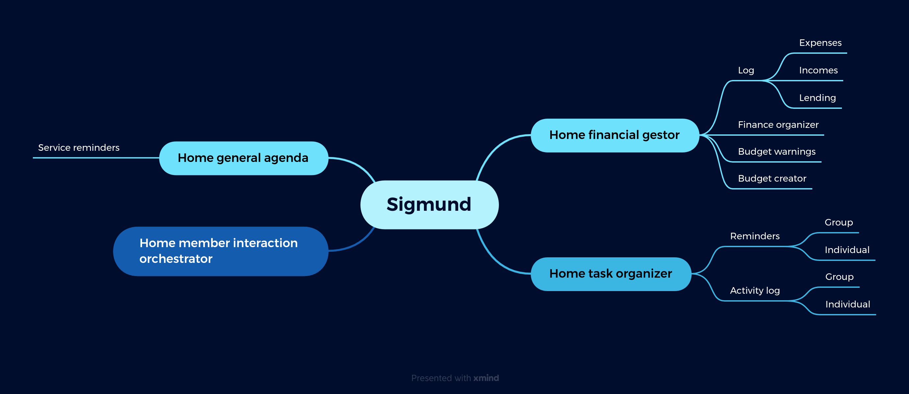

  

<h1>
  
  Sigmund Assistant
</h1>

  
  

> <b>Sigmund</b> is a <a href="https://www.signal.org/">Signal</a> assistant bot for finance and home organization, written in Python using <a href="https://github.com/AsamK/signal-cli">signal-cli</a>, that helps to create an organized financial gestor and to orchestrate the tasks and interaction of the home members.

<h2>
  Mind Map
</h2>

  

<h2 id="Installation">
  Installation
</h1>

<h2>
  Usage
</h2>

## 🤝 Contributing

Contributions, issues and feature requests are welcome! Feel free to check [issues page](https://github.com/AndreIglesias/sigmund/issues). 

## Show your support

Give a ⭐️ if this project helped you!

## 📝 License

Copyright © 2023 [Andre Iglesias](https://github.com/AndreIglesias). 
This project is [GNU General Public License v3.0](https://github.com/AndreIglesias/sigmund/blob/main/LICENSE) licensed.

